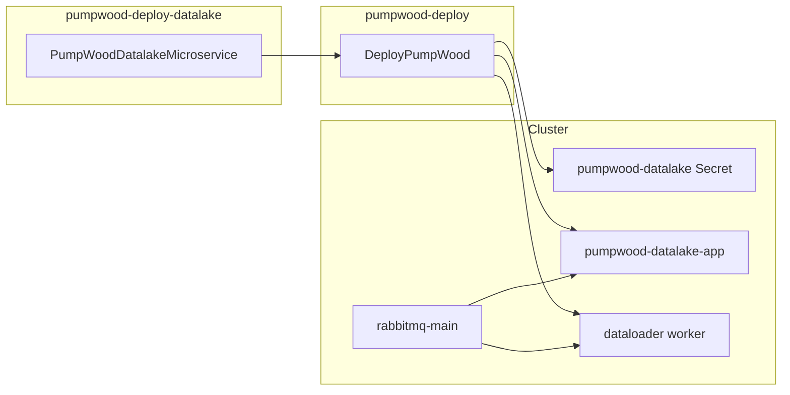

# pumpwood-deploy-datalake

Satellite deploy package for the **Pumpwood Datalake** microservice on
Kubernetes. It generates manifests for the API application, dataloader
worker, and datalake secrets — then hands them to
[`pumpwood-deploy`](https://github.com/Murabei-OpenSource-Codes/pumpwood-deploy)
for apply.

Developed by [Murabei Data Science](https://murabei.com). BSD-3-Clause.

<p align="center" width="60%">
   <br>

  <a href="https://en.wikipedia.org/wiki/Cecropia">
    Pumpwood is a native Brazilian tree
  </a> with a symbiotic relation to ants (Murabei)
</p>

---

## What it deploys

| Manifest | Kubernetes resources |
|----------|----------------------|
| `pumpwood_datalake__secrets` | Secret `pumpwood-datalake` |
| `pumpwood_datalake__deploy` | Deployment + Service `pumpwood-datalake-app` |
| `pumpwood_datalake_dataloader__worker` | Deployment `pumpwood-datalake-dataloader-worker` |

Datalake defines **modeling units** — the main dimension for storing
structured data in Pumpwood. The app serves HTTP APIs; the dataloader
worker consumes RabbitMQ messages and uploads data in parallel chunks.



---

## Prerequisites

This package does **not** stand alone. Before datalake pods can start,
the cluster must already provide:

| Resource | Provided by |
|----------|-------------|
| `storage` ConfigMap | `StandardMicroservices` in `pumpwood-deploy` |
| `general-secrets` | `StandardMicroservices` |
| `rabbitmq-main-secrets` | `StandardMicroservices` |
| Storage keys (GCP / Azure / AWS) | `DeployPumpWood` storage config |
| Postgres for datalake | `PostgresDatabase` + `PGBouncerDatabase` |
| Auth (typical) | [`pumpwood-deploy-auth`](https://github.com/Murabei-OpenSource-Codes/pumpwood-deploy-auth) |

Storage bucket name and type are read from the cluster `storage`
ConfigMap — they are **not** passed to `PumpWoodDatalakeMicroservice`.

For local or CI dev databases, deploy Postgres/PgBouncer from
`pumpwood-deploy` instead of an embedded test database (removed from
this satellite package).

---

## Installation

```bash
pip install pumpwood-deploy-datalake
```

Requires `pumpwood-deploy`.

---

## Quick start

```python
import os
import simplejson as json
from dotenv import load_dotenv
from pumpwood_deploy.deploy import DeployPumpWood
from pumpwood_deploy.microservices.postgres.deploy import (
    PostgresDatabase, PGBouncerDatabase)
from pumpwood_deploy_datalake import PumpWoodDatalakeMicroservice

with open("secrets/production.json", "r") as file:
    secrets = json.loads(file.read())
load_dotenv()

deploy = DeployPumpWood(
    model_user_password=secrets["microservices--model"],
    rabbitmq_secret=secrets["rabbitmq_secret"],
    hash_salt=secrets["hash_salt"],
    storage_type="aws_s3",
    storage_deploy_args={
        "storage_bucket_name": "my-pumpwood-bucket",
        "access_key_id": secrets["aws_access_key_id"],
        "secret_access_key": secrets["aws_secret_access_key"],
    },
    k8_provider="aws",
    k8_deploy_args={
        "region": "us-east-1",
        "cluster_name": "my-cluster",
    },
    k8_namespace="pumpwood",
)

deploy.add_microservice(
    PostgresDatabase(
        db_username="pumpwood",
        db_password=secrets["postgres_password"],
        name="postgres-main",
        disk_name="postgres-disk",
        disk_size="150Gi",
    ))

deploy.add_microservice(
    PGBouncerDatabase(
        name="pgbouncer-pumpwood-datalake",
        postgres_database="pumpwood_datalake",
        postgres_secret="postgres-main",
        postgres_host="postgres-main",
    ))

deploy.add_microservice(
    PumpWoodDatalakeMicroservice(
        app_version=os.getenv("PUMPWOOD_DATALAKE_APP"),
        worker_version=os.getenv("PUMPWOOD_DATALAKE_WORKER"),
        repository="my-registry.example.com",
        db_host="pgbouncer-pumpwood-datalake",
        db_database="pumpwood_datalake",
        db_password=secrets["postgres_password"],
        microservice_password=secrets["microservice--datalake"],
        app_replicas=1,
        app_debug="FALSE",
        worker_replicas=1,
        worker_n_parallel=4,
    ))

deploy.create_deploy_files()
deploy.deploy_microservices()
```

### Environment variables

```bash
PUMPWOOD_DATALAKE_APP=2.1.0
PUMPWOOD_DATALAKE_WORKER=1.4.0
```

If the rendered manifest matches what is already on the cluster, `kubectl
apply` produces no changes — safe for rolling image updates.

---

## Configuration reference

### Required

| Parameter | Description |
|-----------|-------------|
| `app_version` | Image tag for `pumpwood-datalake-app` |
| `worker_version` | Image tag for `pumpwood-datalake-dataloader-worker` |

### Database

| Parameter | Default | Description |
|-----------|---------|-------------|
| `db_host` | `postgres-pumpwood-datalake` | Postgres host (use PgBouncer in prod) |
| `db_port` | `5432` | Postgres port |
| `db_database` | `pumpwood` | Database name |
| `db_username` | `pumpwood` | Database user |
| `db_password` | `pumpwood` | Database password |
| `microservice_password` | `microservice--datalake` | Service user password |
| `repository` | GCR default | Docker registry for app and worker |

### Application

| Parameter | Default | Description |
|-----------|---------|-------------|
| `app_replicas` | `1` | Number of app pods |
| `app_debug` | `FALSE` | Debug flag |
| `app_workers` | `10` | Granian workers (`GRANIAN_WORKERS`) |
| `app_timeout` | `300` | Request timeout (seconds) |
| `app_limits_memory` | `60Gi` | Memory limit |
| `app_limits_cpu` | `12000m` | CPU limit |
| `app_requests_memory` | `20Mi` | Memory request |
| `app_requests_cpu` | `1m` | CPU request |

### Dataloader worker

| Parameter | Default | Description |
|-----------|---------|-------------|
| `worker_replicas` | `1` | Worker pod count |
| `worker_debug` | `FALSE` | Worker debug flag |
| `worker_n_parallel` | `4` | Parallel upload requests |
| `worker_chunk_size` | `1000` | Rows per parallel batch |
| `worker_query_limit` | `1000000` | Max rows per upload cycle |
| `worker_limits_memory` | `60Gi` | Worker memory limit |
| `worker_limits_cpu` | `12000m` | Worker CPU limit |
| `worker_requests_memory` | `20Mi` | Worker memory request |
| `worker_requests_cpu` | `1m` | Worker CPU request |

---

## Health check

The app Deployment exposes a readiness probe at:

```
GET /health-check/pumpwood-datalake-app/  (port 5000)
```

Use this path for ingress and load balancer health checks.

---

## Migration note

Older deploy scripts imported from the monolithic package:

```python
# Before
from pumpwood_deploy.microservices.pumpwood_datalake.deploy import (
    PumpWoodDatalakeMicroservice)

# After
from pumpwood_deploy_datalake import PumpWoodDatalakeMicroservice
```

Removed from the satellite API (use cluster-level config instead):

- `bucket_name` — now from `storage` ConfigMap
- `test_db_*` — use `PostgresDatabase` / `PGBouncerDatabase` from core

---

## Related packages

| Package | Role |
|---------|------|
| [`pumpwood-deploy`](https://github.com/Murabei-OpenSource-Codes/pumpwood-deploy) | Orchestrator, Kong, RabbitMQ, Postgres |
| [`pumpwood-deploy-auth`](https://github.com/Murabei-OpenSource-Codes/pumpwood-deploy-auth) | Authorization microservice |
| [`pumpwood-deploy-graph-datalake`](https://github.com/Murabei-OpenSource-Codes/pumpwood-deploy-graph-datalake) | Graph datalake variant |

Full platform documentation:
[Murabei Open Source — pumpwood-deploy](https://murabei-opensource-codes.github.io/pumpwood-deploy/).

---

## Development

```bash
pip install -e ../pumpwood-deploy
pip install -e .

ruff check src/
```

---

## License

BSD-3-Clause — see [LICENSE](LICENSE).
